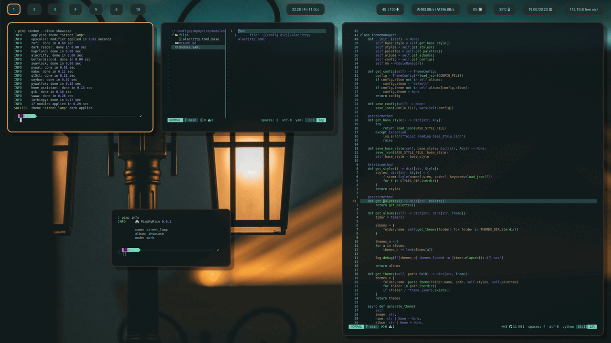

# 🍙 PimpMyRice

Creating and swapping rices made easy

_This project is currently in alpha and may be subject to breaking changes._



## Quick start

### Install

<!-- #### Arch Linux -->
<!---->
<!-- ```bash -->
<!-- yay -S pimpmyrice-git -->
<!-- ``` -->
<!---->
<!-- #### Ubuntu -->
<!---->
<!-- ```bash -->
<!-- sudo add-apt-repository ppa:daddodev/pimpmyrice -->
<!-- sudo apt-get update -->
<!-- sudo apt-get install pimpmyrice -->
<!-- ``` -->

#### [Pipx](https://pipx.pypa.io/stable/installation/)

```bash
pipx install git+https://github.com/daddodev/pimpmyrice.git
```

### Add some modules

<!-- [Create your own modules]() from scratch or clone from the [official modules](). -->
Create your own modules from scratch or clone from the [official modules](https://github.com/pimpmyrice-modules).

For example, clone the [alacritty](https://github.com/pimpmyrice-modules/alacritty) module:

```bash
pimp clone module pimp://alacritty
```


### Generate and apply a new theme

Generate a theme from an image:

```bash
pimp gen Downloads/example.png
# or
pimp gen https://website.com/example.png
```

Set the generated theme:

```bash
pimp set theme example
```

## Documentation

<!-- Full documentation [**here**](./docs/overview.md). -->

Full documentation coming soon™
