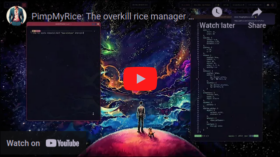

_This project is currently in beta and may be subject to breaking changes._

# 🍙 PimpMyRice

### The overkill rice manager

I heard you like ricing, so I made a ricer for your rices.

[📄 Documentation](https://pimpmyrice.vercel.app/docs) ║ [📦 Starter Modules](https://pimpmyrice.vercel.app/modules) ║ [💬 Discord](https://discord.gg/TDrSB2wk6c)

#### See it in action:

[](https://www.youtube.com/watch?v=Z0MnaKWo25U)


## ❓ What is a rice?

> Ricing refers to the process of customizing the visual appearance and functionality of a desktop environment, usually in Linux or Unix-based systems.<br />
It involves tweaking themes, icons, fonts, and configurations to achieve a unique and aesthetically pleasing interface.<br />
A well-customized setup, called a "rice", showcases the user's attention to detail, personality and creativity.

Take a look at [r/unixporn](https://www.reddit.com/r/unixporn) for inspiration.


## 🤔 What does PimpMyRice do?

PimpMyRice allows you to generate, organize and apply [themes](https://pimpmyrice.vercel.app/docs/theme) to your system.<br />
It applies them through [modules](https://pimpmyrice.vercel.app/docs/module), each module being responsible for styling a specific program (eg: [discord](https://github.com/pimpmyrice-modules/betterdiscord)).

See [overview](https://pimpmyrice.vercel.app/docs/overview) for more information.

### ⚙️ Features

- 🚀 Easy to get started
- 🛠️ Infinitely customizable
- 📜 Powerful [file](https://pimpmyrice.vercel.app/docs/module#file) and [shell command](https://pimpmyrice.vercel.app/docs/module#shell) templating using [Jinja](https://jinja.palletsprojects.com/en/3.1.x/templates/)
- 🐍 [Extendable through Python](https://pimpmyrice.vercel.app/docs/module#python)
- ⚡ Fast enough
- 📝 Autocomplete in editor and terminal*
- 🌈 Color extraction*
- 🔗 [Server with API](https://github.com/daddodev/pimpmyrice_server)*
- 🖼️ GUI (coming soon™)

_*WIP_


## 🚀 Quick start

### 📥 Install

#### Arch Linux

```bash
yay -S pimpmyrice
# or
yay -S pimpmyrice-git
```

#### Pipx

```bash
pipx install pimpmyrice
```

### 📦 Add some modules

[Create your own modules](https://pimpmyrice.vercel.app/docs/module) from scratch or clone from the [starter modules](https://pimpmyrice.vercel.app/modules) to get started.

For example, clone the [alacritty](https://github.com/pimpmyrice-modules/alacritty) module:

```bash
pimp clone module pimp://alacritty
```

Delete a module:
```bash
pimp delete module alacritty
```

### 🎨 Generate and apply a new theme

Generate a theme from an image:

```bash
pimp gen Downloads/example.png
# or
pimp gen https://website.com/example.png
```

Set the generated theme:

```bash
pimp set theme example
```

Delete a theme:

```bash
pimp delete theme example
```

### 🌟 Start ricing

Edit the current theme:

```bash
pimp edit theme
```


Edit the base style:

```bash
pimp edit base-style
```

Enjoy ricing! 🍙

**[<kbd>Browse the documentation</kbd>](https://pimpmyrice.vercel.app/docs/overview)** 

## 🙏 Related Projects / Thanks 

- [pywal](https://github.com/dylanaraps/pywal)
- [wpgtk](https://github.com/deviantfero/wpgtk)
- [r/unixporn](https://www.reddit.com/r/unixporn)
